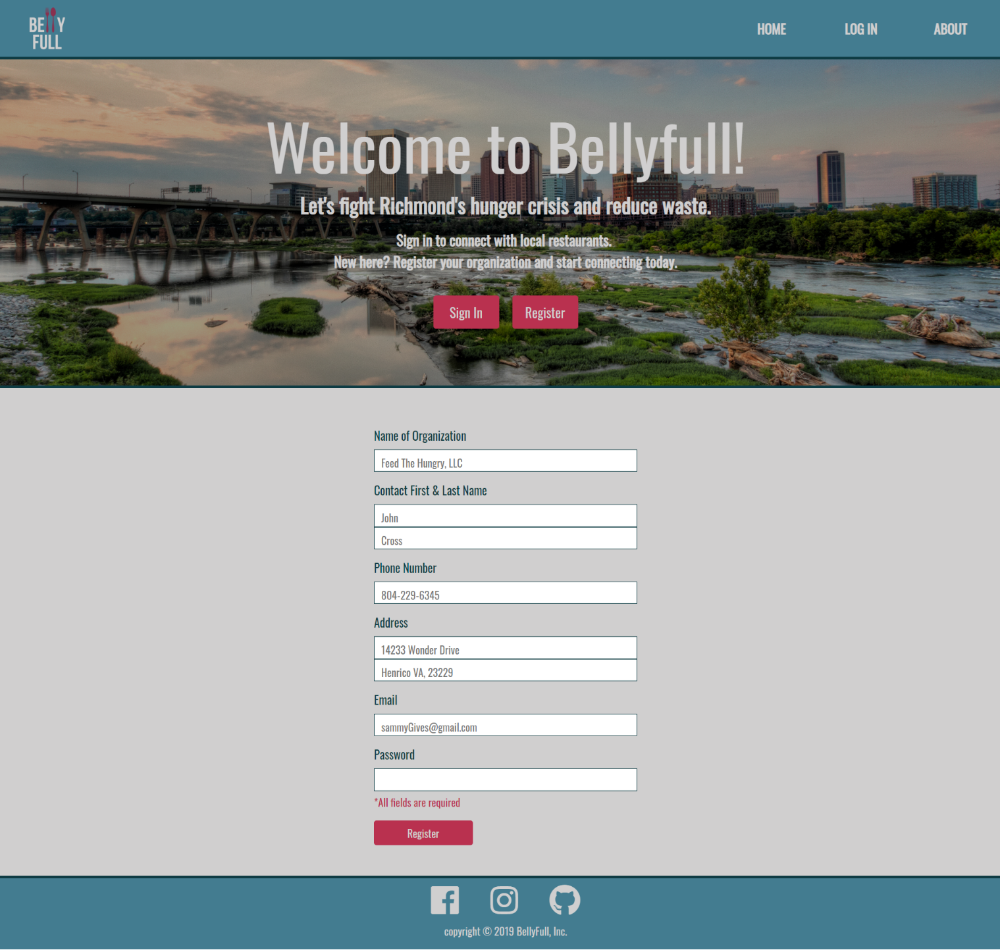
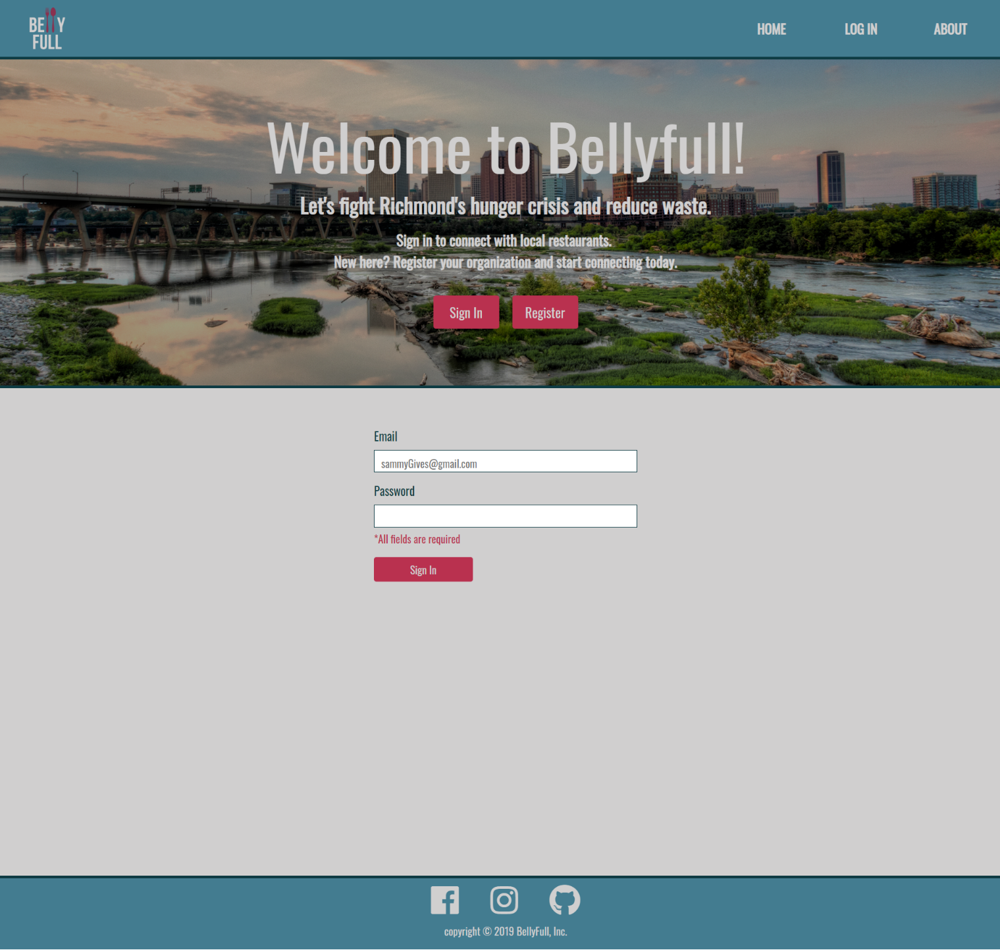
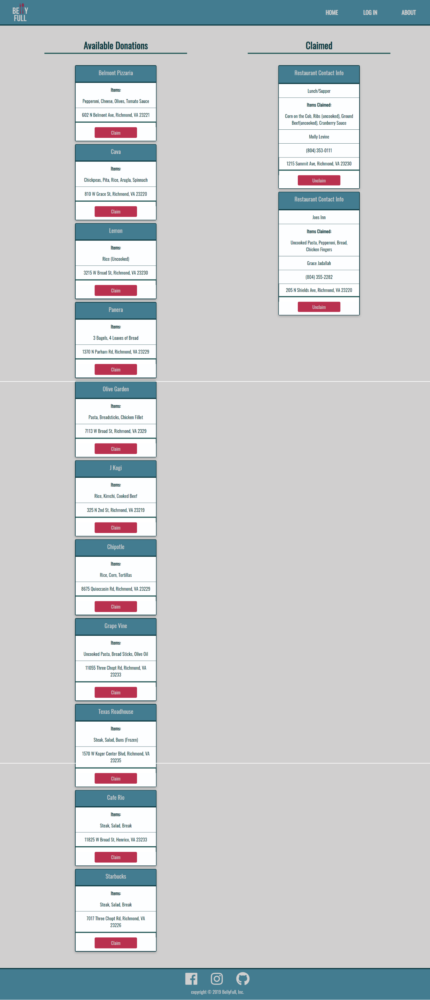

# BellyFull

## Team Members:
* Carrie Mosby
* Molly Levine
* Nimeh Jadallah

## Technology Used:
* React Framework
* Bootstrap 4
* Javascript
* MongoDB
* Mongoose
* Express
* Unform
* Yup

## Project Description:
**BellyFull** is a website that allows local restaurants to list their leftover items each day for non-profits to claim. Once a non-profit register, they will be redirected to the donations page to claim items. Contact info will be listed for non-profits to be able to communicate with the restaurants and get the items claimed.

* Non-profits have to fill out the registration form through the login/registration page before they can be redirected to the donations page where they can claim items.

* for returning non-profits, they have to sign in using the email they have registered with, then will be redirected to the donations page.

* When a non-profit gets redirected to the donations page, they will see available items that they can claim. They can also see which items have been claimed.

## Deployment
* Checkout our Website on Heroku
[BellyFull](https://bellyfull-rva.herokuapp.com/)

## Special Thanks
We would like to credit Danny Tiet. for creating a logo for our website and for allowing us to use an image taken by him for our home and logIn pages.

